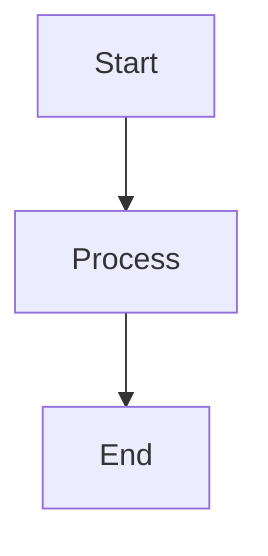
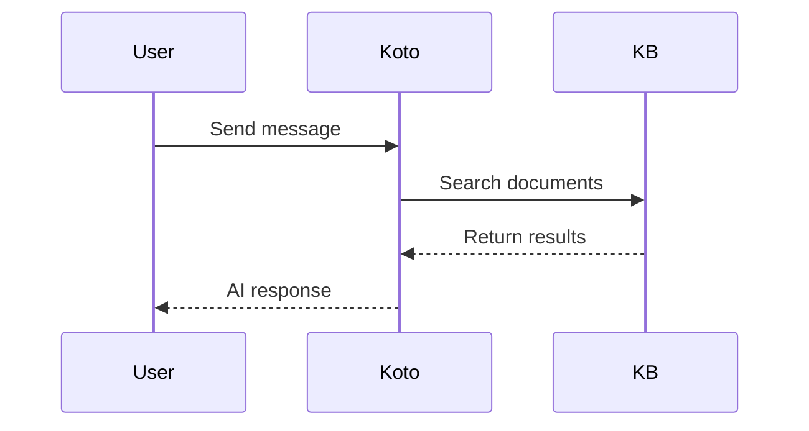

# Koto Features Quick Reference

## 🧠 Memory System (Phase 2A)

### How to Store Memories
**In Settings Panel:**
1. Open Settings (⚙️ icon)
2. Find "Memory" section
3. Type memory in input field
4. Click "Add Memory"
5. Memory auto-saved to `config/memory.json`

**Programmatically:**
```python
from web.memory_manager import MemoryManager

mm = MemoryManager()
mm.add_memory("用户喜欢编写 Python", category="preference")
```

### Memory Categories
- `user_preference` - User likes/dislikes, habits
- `fact` - Factual information
- `project_info` - Project details
- `correction` - Corrections to previous mistakes

### Memory Search
**In Code:**
```python
# Search by keyword
results = mm.search_memories("Python", limit=5)

# Get context for LLM injection
context = mm.get_context_string(user_input)
```

### Auto-Injection
Koto automatically:
1. Searches relevant memories based on your input
2. Formats them as a "User Memory" section
3. Prepends to the AI's system instruction
4. AI considers these when generating responses

## 📚 Knowledge Base (Phase 3A)

### Adding Documents
**Scan Directory:**
```python
from web.knowledge_base import KnowledgeBase

kb = KnowledgeBase()
result = kb.scan_directory("path/to/documents")
# Supports: .txt, .md, .docx, .pdf
```

**Add Single Document:**
```python
kb.add_document("path/to/document.pdf")
print(kb.get_stats())
```

### Semantic Search
```python
# Find relevant chunks by meaning
results = kb.search("Tell me about Koto", top_k=5)

for result in results:
    print(f"Similarity: {result['similarity']:.3f}")
    print(f"From: {result['file_name']}")
    print(f"Content: {result['text'][:100]}...")
```

### Knowledge Base Statistics
```python
stats = kb.get_stats()
# Returns:
# - total_documents
# - total_chunks
# - total_size_mb
# - file_types
# - last_updated
```

### Supported File Types
| Format | Support | Notes |
|--------|---------|-------|
| .txt | ✅ Full | Plain text files |
| .md | ✅ Full | Markdown documents |
| .docx | ✅ Partial | Requires `python-docx` |
| .pdf | ✅ Partial | Requires `PyPDF2` |

## 📐 Advanced Markdown Features (Phase 1)

### KaTeX Math Formulas

**Inline Math:**
```markdown
The equation $E = mc^2$ is famous.
```
Renders: The equation $ E = mc^2 $ is famous.

**Block Math:**
```markdown
$$
\frac{-b \pm \sqrt{b^2 - 4ac}}{2a}
$$
```

### Mermaid Diagrams

**Flowchart:**
```markdown

```

**Sequence Diagram:**
```markdown

```

### Markdown Tables
```markdown
| Feature | Status | Notes |
|---------|--------|-------|
| Memory  | ✅     | Cross-session |
| Vector KB | ✅  | Semantic search |
| Math    | ✅     | KaTeX rendering |
```

## 🎨 Artifacts Panel (Phase 1E)

### Usage
1. **Long Code Blocks**: Click "⟨/⟩" button (appears >5 lines)
2. **Side Panel Opens**: See code preview on right
3. **Tabs Available**:
   - **Preview**: Renders HTML/Markdown
   - **Code**: Read/edit raw code
4. **Actions**:
   - Copy to clipboard
   - Download as file
   - Close panel

### Supported Formats
- HTML / SVG - Visual preview
- Markdown - Formatted display
- Code (Python, JS, etc) - Syntax highlighting
- All text formats

## 🔑 Configuration

### Memory Settings
**File:** `config/memory.json`
```json
[
  {
    "id": 1234567890000,
    "content": "用户喜欢编写 Python",
    "category": "user_preference",
    "source": "user",
    "created_at": "2024-01-15 10:30:45",
    "use_count": 2
  }
]
```

### Knowledge Base Settings
**Index File:** `workspace/knowledge_base/index.json`
**Chunks File:** `workspace/knowledge_base/chunks.json`

Edit KB behavior in `web/knowledge_base.py`:
```python
CHUNK_SIZE = 500      # Text chunk size (chars)
CHUNK_OVERLAP = 50    # Overlap between chunks
BATCH_SIZE = 20       # API batch size
```

### Gemini API Setup
For full vector embeddings:
```bash
# Windows
set GEMINI_API_KEY=sk-...

# Linux/Mac
export GEMINI_API_KEY=sk-...
```

Without API key: System uses zero vectors (graceful fallback).

## 📊 API Endpoints

### Memory API
```
POST /api/memories
  Body: {"content": "text", "category": "type", "source": "user"}
  Returns: Memory object with ID

GET /api/memories?q=search_term
  Returns: Array of matching memories

DELETE /api/memories/{id}
  Returns: Success/error message
```

### Knowledge Base API
Currently internal (no REST endpoints yet). Use Python SDK:
```python
from web.knowledge_base import KnowledgeBase
kb = KnowledgeBase()
```

## 🧪 Quick Test

```python
# Test all features
python test_phase2_3a.py

# Expected output:
# ✓ TEST 1 PASSED: Memory Manager
# ✓ TEST 2 PASSED: Vector Knowledge Base  
# ✓ TEST 3 PASSED: Integration
```

## 🐛 Troubleshooting

### Memory Not Persisting
- Check `config/memory.json` exists
- Verify write permissions on config directory
- Restart application

### KB Search Returns Nothing
- No documents added yet - use `kb.scan_directory()`
- GEMINI_API_KEY not set - system uses fallback vectors
- Check `workspace/knowledge_base/` directory exists

### Math/Diagram Not Rendering
- KaTeX/Mermaid CDN required (check network)
- Browser console for error details
- Clear browser cache

### Artifacts Panel Not Showing
- Code block must be >5 lines
- Button appears bottom-right of code block
- Close with X or click outside panel

## 💡 Best Practices

### Memory Management
✅ **DO:**
- Store unique, important information
- Use consistent categories
- Review and update regularly

❌ **DON'T:**
- Store sensitive credentials
- Create duplicate memories
- Overload with low-value data

### Knowledge Base
✅ **DO:**
- Organize documents by topic
- Use descriptive file names
- Keep chunks at optimal size (500 chars)

❌ **DON'T:**
- Add very large files (>100MB)
- Mix unrelated content
- Forget to index new documents

## 🔮 Upcoming Features

### Phase 4 - Agent Planning
- Multi-step task planning
- Automatic plan execution
- Error correction & retry

### Phase 2B-D - Memory Enhancement
- Auto-extract key facts from conversations
- Semantic memory search (upgrade from keyword)
- Memory UI management tools

### Phase 5-10
- Advanced knowledge processing
- Multi-model integration
- Workflow automation
- ... and more!

---
**Last Updated**: Phase 3A Complete  
**Ready for**: Phase 4 Implementation
