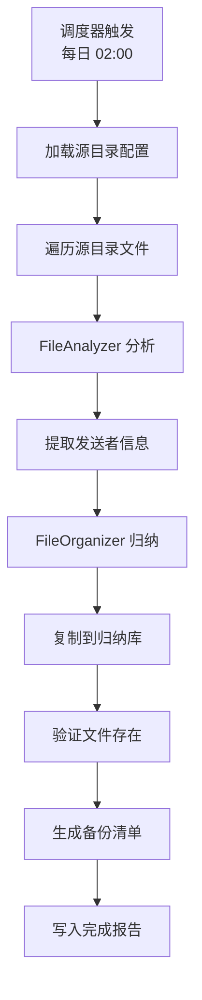

# 自动归纳功能使用指南

## 功能概述

自动归纳系统按照每天设定的时间，自动对指定文件夹（如微信文件目录）进行智能归纳，归纳完成后：
- ✅ 文件按类别自动分配到归纳库（`workspace/_organize`）
- ✅ 原始文件保持不变（采用复制模式）
- ✅ 生成备份清单，确认本地有备份文件
- ✅ 自动提取发送者信息（Office 文档、PDF 元数据）

---

## 快速启动

### 1. 启用自动归纳（API 调用）

```bash
# POST /api/auto-catalog/enable
curl -X POST http://localhost:5000/api/auto-catalog/enable \
  -H "Content-Type: application/json" \
  -d '{
    "schedule_time": "02:00",
    "source_directories": [
      "C:\\Users\\12524\\Documents\\WeChat Files\\wxid_vfk3vjs6qgtn22\\FileStorage\\File\\2026-02"
    ]
  }'
```

**返回示例：**
```json
{
  "success": true,
  "message": "自动归纳已启用，每日 02:00 执行",
  "schedule_time": "02:00",
  "source_directories": [
    "C:\\Users\\12524\\Documents\\WeChat Files\\wxid_vfk3vjs6qgtn22\\FileStorage\\File\\2026-02"
  ]
}
```

### 2. 查看状态

```bash
# GET /api/auto-catalog/status
curl http://localhost:5000/api/auto-catalog/status
```

**返回示例：**
```json
{
  "success": true,
  "enabled": true,
  "schedule_time": "02:00",
  "source_directories": [
    "C:\\Users\\12524\\Documents\\WeChat Files\\..."
  ],
  "backup_directory": "C:\\Users\\12524\\Desktop\\Koto\\workspace\\_organize\\_backups"
}
```

### 3. 手动立即执行

```bash
# POST /api/auto-catalog/run-now
curl -X POST http://localhost:5000/api/auto-catalog/run-now
```

**返回示例：**
```json
{
  "success": true,
  "total_files": 49,
  "organized_count": 47,
  "backed_up_count": 47,
  "errors": [],
  "report_path": "C:\\Users\\12524\\Desktop\\Koto\\workspace\\_organize\\_reports\\auto_catalog_report_20260202_140530.md"
}
```

### 4. 禁用自动归纳

```bash
# POST /api/auto-catalog/disable
curl -X POST http://localhost:5000/api/auto-catalog/disable
```

---

## 配置文件（config/user_settings.json）

```json
{
  "auto_catalog": {
    "enabled": true,
    "schedule_time": "02:00",
    "source_directories": [
      "C:\\Users\\12524\\Documents\\WeChat Files\\wxid_vfk3vjs6qgtn22\\FileStorage\\File\\2026-02"
    ],
    "backup_dir": null,
    "backup_retention_days": 30
  }
}
```

**配置说明：**

| 字段 | 说明 | 默认值 |
|------|------|--------|
| `enabled` | 是否启用自动归纳 | `false` |
| `schedule_time` | 每日执行时间（HH:MM 格式） | `"02:00"` |
| `source_directories` | 源目录列表（要归纳的文件夹） | `[]` |
| `backup_dir` | 备份清单存储目录 | `workspace/_organize/_backups` |
| `backup_retention_days` | 备份清单保留天数 | `30` |

**注意：**
- 如果 `source_directories` 为空，系统会自动使用 `storage.wechat_files_dir`
- `backup_dir` 为 `null` 时会使用默认路径

---

## 归纳结果

### 目录结构

```
workspace/
├── _organize/
│   ├── finance/              # 财务文档
│   ├── work/                 # 工作文档
│   ├── personal/             # 个人文档
│   ├── development/          # 开发代码
│   ├── media/                # 图片视频
│   ├── other/                # 其他未分类
│   ├── _reports/             # 归纳报告
│   │   ├── auto_catalog_report_20260202_140530.md
│   │   └── folder_catalog_*.md
│   └── _backups/             # 备份清单
│       └── backup_manifest_2026-02_20260202_140530.json
```

### 备份清单格式（backup_manifest_*.json）

```json
{
  "timestamp": "20260202_140530",
  "source_dir": "C:\\Users\\12524\\Documents\\WeChat Files\\...",
  "backup_time": "2026-02-02T14:05:30.123456",
  "files": [
    {
      "original_path": "C:\\Users\\12524\\Documents\\WeChat Files\\...\\账户信息.xlsx",
      "organized_path": "C:\\Users\\12524\\Desktop\\Koto\\workspace\\_organize\\finance\\2026\\Q1\\银行\\账户信息.xlsx",
      "source_exists": true,
      "organized_exists": true,
      "file_size": 15360,
      "organized_at": "2026-02-02T14:05:30.456789"
    }
  ]
}
```

**字段说明：**
- `source_exists`: 原始文件是否仍存在（验证源文件安全）
- `organized_exists`: 归纳后的文件是否存在（验证复制成功）
- `file_size`: 归纳后文件大小（字节）

---

## 归纳报告（auto_catalog_report_*.md）

```markdown
# 自动归纳报告

**执行时间**: 2026-02-02 14:05:30

## 统计

- 总文件数: 49
- 已归纳: 47
- 已备份: 47
- 成功率: 95.9%

## 源目录

- C:\Users\12524\Documents\WeChat Files\wxid_vfk3vjs6qgtn22\FileStorage\File\2026-02

## 备份目录

C:\Users\12524\Desktop\Koto\workspace\_organize\_backups

## 执行状态

✅ 全部成功，无错误
```

---

## 技术架构

### 核心组件

1. **AutoCatalogScheduler** (`web/auto_catalog_scheduler.py`)
   - 调度器主类
   - 定时任务注册
   - 备份验证逻辑

2. **TaskScheduler** (`web/task_scheduler.py`)
   - 底层任务调度引擎（使用 `schedule` 库）
   - 支持 daily/weekly/hourly 调度

3. **FolderCatalogOrganizer** (`web/folder_catalog_organizer.py`)
   - 批量文件夹归纳
   - 发送者信息提取

4. **FileOrganizer** (`web/file_organizer.py`)
   - 单文件归纳执行
   - 文件复制（保留原文件）

### 执行流程



### 备份验证机制

1. **归纳前**：记录源文件路径
2. **归纳中**：使用 `shutil.copy2` 复制文件（保留元数据）
3. **归纳后**：
   - 检查源文件是否仍存在（`source_exists`）
   - 检查归纳文件是否存在（`organized_exists`）
   - 记录文件大小（`file_size`）
   - 写入备份清单 JSON

---

## API 端点总结

| 端点 | 方法 | 说明 |
|------|------|------|
| `/api/auto-catalog/status` | GET | 查看自动归纳状态 |
| `/api/auto-catalog/enable` | POST | 启用自动归纳 |
| `/api/auto-catalog/disable` | POST | 禁用自动归纳 |
| `/api/auto-catalog/run-now` | POST | 立即执行归纳 |
| `/api/auto-catalog/backup-manifest/<filename>` | GET | 下载备份清单 |

---

## 使用场景

### 场景 1：微信文件自动整理
每天凌晨 2 点自动归纳微信文件夹，财务文档、工作资料自动分类。

### 场景 2：批量文件迁移
手动立即执行（`/run-now`），将大量散乱文件快速归纳。

### 场景 3：文件备份验证
归纳后检查备份清单，确认所有文件已安全复制。

---

## 常见问题

**Q1: 归纳会删除原始文件吗？**  
A: 不会。系统使用 `shutil.copy2` 复制文件，原始文件保持不变。

**Q2: 如何验证文件已备份？**  
A: 查看 `workspace/_organize/_backups/backup_manifest_*.json`，检查 `source_exists` 和 `organized_exists` 字段。

**Q3: 可以添加多个源目录吗？**  
A: 可以。在 `source_directories` 数组中添加多个路径。

**Q4: 调度时间支持多次执行吗？**  
A: 当前版本仅支持每日一次，如需多次可手动调用 `/run-now`。

**Q5: 发送者信息提取失败怎么办？**  
A: 系统会尝试从 Office/PDF 元数据提取，失败则从文件名前缀推断（如 `guoji_contract.docx` → `guoji`），最终标记为"未知"。

---

## 完成时间

✅ 功能已实现（2026-02-02）

---

## 相关文档

- [文件组织系统快速开始](FILE_ORGANIZATION_QUICKSTART.md)
- [智能文档分析器指南](INTELLIGENT_DOCUMENT_ANALYZER_GUIDE.md)
- [文件网络架构](docs/FILE_NETWORK_ARCHITECTURE.md)
